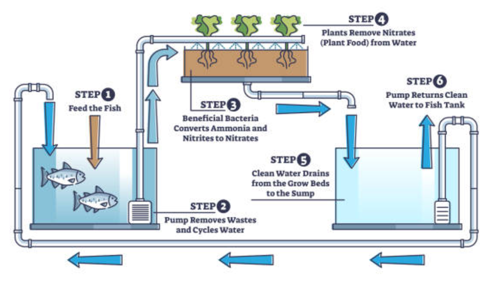

# Aquaponics Project

## Part 1 - Sump Demo

- Motor driver
- Arduino Uno WiFi
- Peristaltic (positive displacement) pump for small scale
- SMPS, create 24 V busbar
- Buck converter from 24 V to 5 V for arduino (LM2596)

## Part 2 - Hydroponics

- Research how to do practical hydroponics
- Nutrient film technique (NFT) or deep water culture (DWC)?
- Shelves, racks, air and water pumps etc…
- Try hydroponics with some simple crops

## Part 3 - Controlled Hydroponics

- Change pump to BLDC centrifugal pump - design to operating point
- Glass fish tank (aquarium) and GFRP sump tank - CHIFT PIST (gravity driven flow)
- Level sensor (ultrasonic sensor or float switch), temperature sensor, pH sensor, dissolved oxygen sensor
- Aquarium pump and irrigation piping; bell siphon (bistable hydraulic oscillator)
- Set up nitrogen cycle, test for stability

## Part 4 - Aquaculture

- Research how to do practical aquaculture and aquaponics
- Add suitable fish to the aquarium
- Fish food
- External filtration required?
- Is it working? Iterate and improve
- Beware: water damage (leaks), humidity (damping), mould growth, noise

## Part 5 - Controlled Aquaponics

- Add sensors and combine subsystems to create a fully controlled aquaponics system

---

# Later Improvement Projects

## Build own fishtank

- Use glass cutting and silicone sealant to build own glass fish tank and sump (or use acrylic)

## Internet of Things (IoT) connectivity

- Use a more robust microcontroller with WiFi or BLE module (e.g. ESP32, Raspberry Pi or STM Nucleo)
- IoT with remote monitoring (e.g. MQTT, cloud edge computing?)
- Make a digital twin in software

## Solar power

- Use standalone solar panel and battery instead of mains supply (use buck converter/transistors and current control for charging) - see Curio Res battery charge controller design
- Maximum power point tracking (MPPT) to the solar panel
- Solar tracking using a mechanical assembly

### PCB design

- Convert electronics to PCB design using fabrication service (e.g. KiCad)

### Better filtration and water quality control

- Use of high-throughput purifiers and reverse osmosis

### Waste utilisation

- Worms to decompose solid waste and produce vermicompost for the plants
- Combine with composter?
- Need to automate the removal of solid waste from the system (tricky)

### Automated fish feed dispensing

- Add a camera and use computer vision to detect when fish feed is low, or to monitor plant growth and health (vision transformer?)
- Build a feeder (e.g. corkscrew-type or rotary vane feeder) and actuate it automatically - revisit Oxitec presentation (mosquito insectary demo)

### Sophisticated control algorithms

- Model predictive control (MPC), maybe with a neural network as the model - slow system dynamics means that we can afford to run a complex control algorithm

### Larger scale system in gazebo

- Build a tented gazebo area with multiple shelves for the grow beds (vertical farming)
- Build a fish pond in the garden
- Bury the sump tank underground to keep it at stable temperature and reduce evaporation
- Artificial lighting (LED grow lights)
- Consider using a PLC for industrial control like Siemens Simatic S7